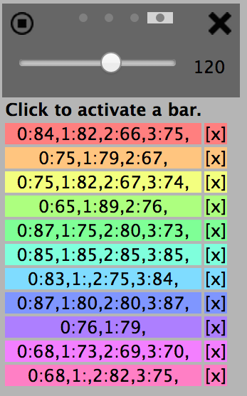
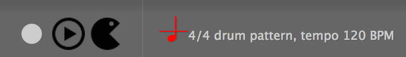

#Neuronal Synchrony

A collection of two dimensional animations that are triggered by sound.

(c) 2012 - 2013 [jonobr1](http://jonobr1.com/). Freely distributed under the [MIT License](http://opensource.org/licenses/MIT).

Prototyped with [Processing](http://processing.org/), built with [JavaScript](http://jonobr1.github.com/two.js).

## Sequencer add on

[live demo](http://kinotel.com/Neuronal-Synchrony/) - this bootstraps with some pre-recorded sequences. Using [Pouchdb](http://pouchdb.com/) to store the sequences.

[screencast on youtube](https://www.youtube.com/watch?v=uhSsgKXRi14&feature=youtu.be)

Built with [Backbone generator](https://github.com/yeoman/generator-backbone)

Sequencing comes from [WAAClock](https://github.com/sebpiq/WAAClock) from [sebpiq](https://github.com/sebpiq).

Uses the [duloop.js](https://github.com/albinotonnina/Neuronal-Synchrony/commit/e4f4268f0d187ae76f31dc73470c3a38aca86ca1)
from  [albinotonnina](https://github.com/albinotonnina) to trigger the graphics.

Icons thanks to [icomoon](http://icomoon.io)

Press the grey button to initiate record.
Press the round triangle button to reveal the sequencer after hiding it.
Press pacman to get instructions.

## Instructions

Use the slider to change the tempo. Click the record button in the credits panel to record new sequences.

Uses pouchdb to save sequences to browser db. TODO: replication w/ a master server.

## Development

Install Yeoman: npm install -g yo

and [Backbone generator](https://github.com/yeoman/generator-backbone)

grunt serve while developing

grunt build to release. This creates a version in the dist directory.

To delete the pouchdb:

indexedDB.deleteDatabase('_pouch_SEQdb');

